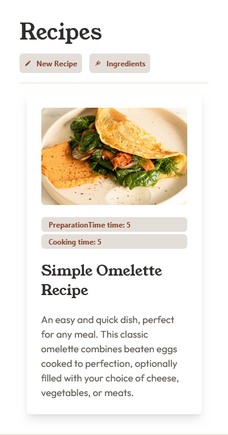
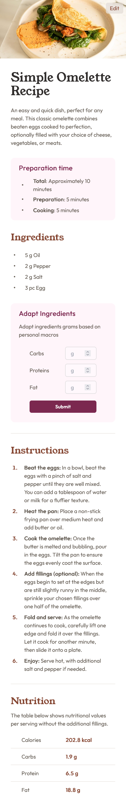
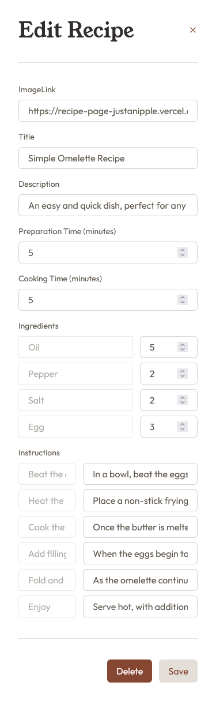
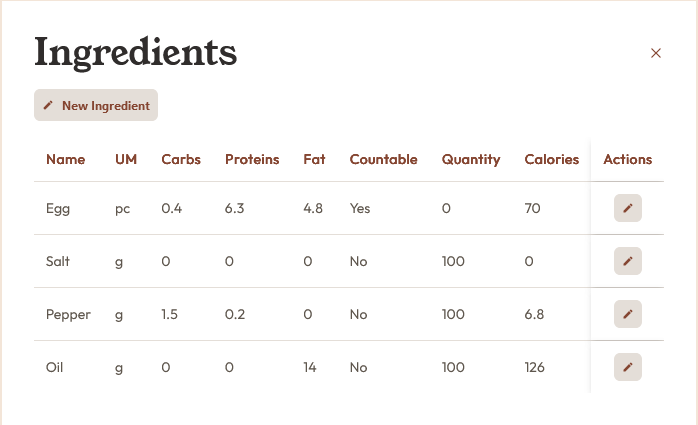
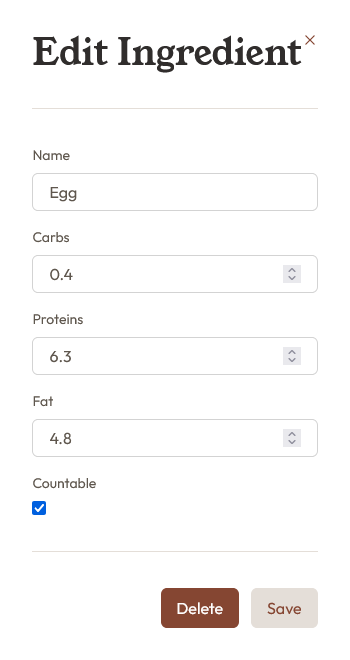

# Frontend Mentor - Recipe page solution

This is a solution to the [Recipe page challenge on Frontend Mentor](https://www.frontendmentor.io/challenges/recipe-page-KiTsR8QQKm). Frontend Mentor challenges help you improve your coding skills by building realistic projects.

## Table of contents

- [Overview](#overview)
  - [The challenge](#the-challenge)
  - [Screenshot](#screenshot)
  - [Links](#links)
- [My process](#my-process)
  - [Built with](#built-with)
  - [What I learned](#what-i-learned)
  - [Continued development](#continued-development)
  - [Useful resources](#useful-resources)
- [Author](#author)

## Overview

### Screenshot

#### Recipes page

#### Recipe detail page

#### Recipe edit page

#### Ingredients page

#### Ingredients edit page

### Links

- Solution URL: [Solution](https://github.com/JustANipple/recipes)
- Live Site URL: [Live](https://recipes-alpha-sooty.vercel.app/)

## My process

### Built with

- Semantic HTML5 markup
- CSS custom properties
- Flexbox
- CSS Grid
- Mobile-first workflow
- TailwindCSS
- [React](https://reactjs.org/) - JS library
- [Next.js](https://nextjs.org/) - JS framework
- [Prisma](https://prisma.io/) - ORM
- [Supabase](https://supabase.com/) - Database
- [Vitest](https://vitest.dev/) - Testing framework
- [Vercel](https://vercel.com/) - Hosting platform

### What I learned

Big of a journey. This was the first time i tried making a full stack from scratch.
This is the whole tech stack that made this possible:

- Database: i made use of [Supabase](https://supabase.com/) and [Prisma](https://prisma.io/) to host and create a consistent relational database for my recipes. I also used [Vitest](https://vitest.dev/) to test my queries.
- Backend: i had a decent grasp of [React](https://reactjs.org/), so i wanted to give my project a structure with [NextJS](https://nextjs.org/) and [Vercel](https://vercel.com/) to host it.
- Frontend: i used [Tailwind](https://tailwindcss.com/docs/installation) to style my project. Very easy to get into and with the help of a very good design from [FrontendMentor](https://www.frontendmentor.io/) i was able to get started.

### Continued development

This was only the beginning, but i'd like to move on to other project to test more technologies that i'm interested in. Maybe one day i'll implement more stuff into this web app

- Authentication: this would let me choose which users can access the site. Also i could give different permissions to users to let them edit their own recipes, while others can only see them.
- API: ingredients are a bit complex to create and not as user friendly as it should be. Making use of an API would help a lot creating recipes without caring much about macros
- Error handling: i'm not sure how to handle errors in my app. It's not clear what part of the app is responsible for throwing errors.

### Useful resources

- [React](https://reactjs.org/) - The official React website has a lot of helpful resources to get started
- [Next.js](https://nextjs.org/) - This framework has a lot of features that give a good start for development
- [Prisma](https://prisma.io/) - The ORM that prisma offers is very easy to use
- [Supabase](https://supabase.com/) - Deploying and hosting my database was easier with Supabase
- [Vitest](https://vitest.dev/) - Testing server actions made my code more consistent
- [Vercel](https://vercel.com/) - This made the hosting part easy with NextJS
- [Tailwind](https://tailwindcss.com/docs/installation) - Great to speed up the styling part

## Author

- Frontend Mentor - [@JustANipple](https://www.frontendmentor.io/profile/JustANipple)
